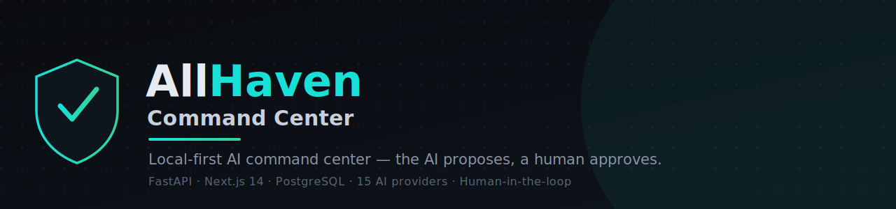
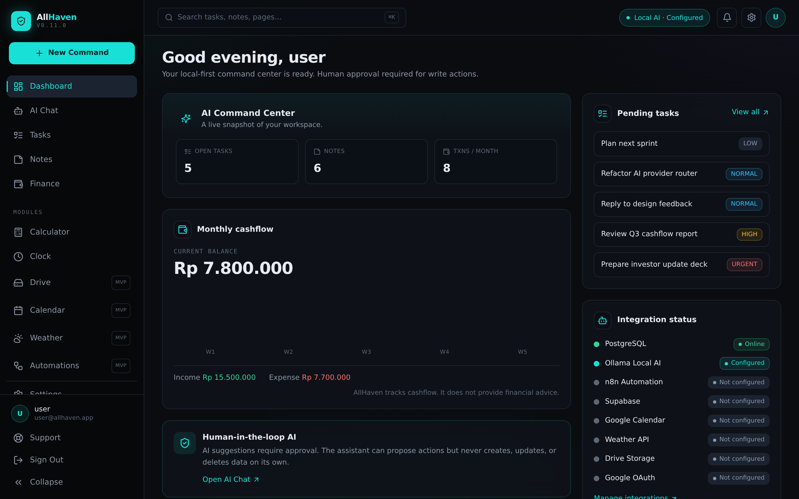
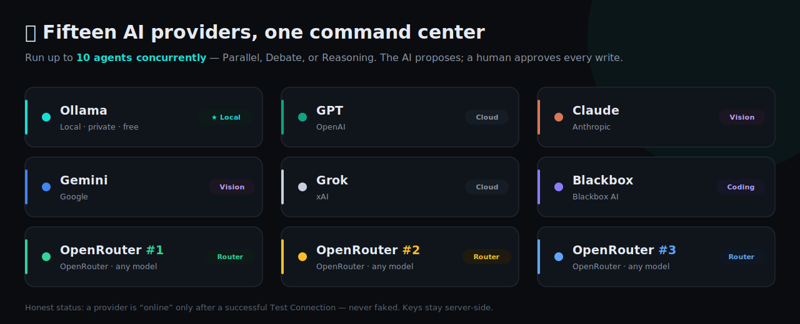
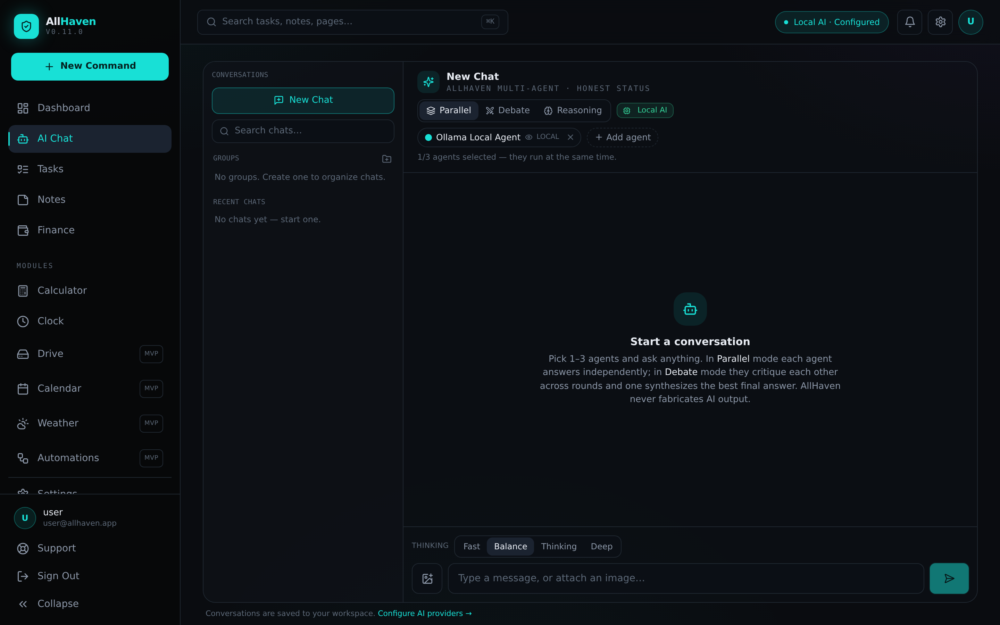
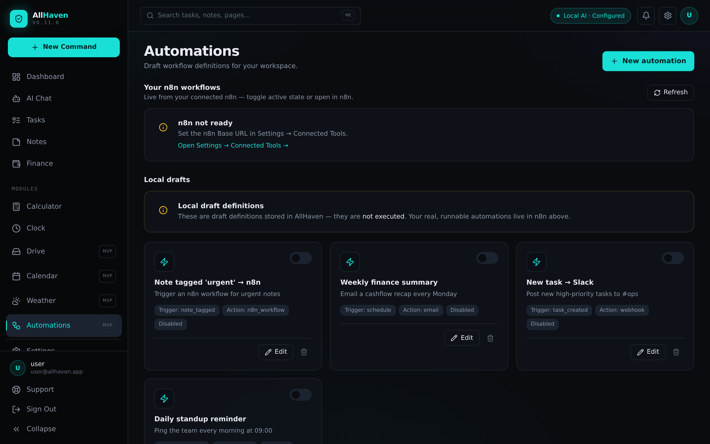

<div align="center">



# AllHaven Command Center

**A modular, local-first AI command center for personal &amp; company productivity.**

_The AI acts fast, but risky writes still need human approval._

[](CHANGELOG.md)
&nbsp;
&nbsp;
&nbsp;
&nbsp;

[**Quick start**](#-easiest-start--one-click) · [What's new](#-whats-new) · [Documentation](docs/) · [Changelog](CHANGELOG.md)

</div>

---

> **AllHaven is _not_ an operating system.** It's a complete, runnable, local-first web
> application (FastAPI + Next.js) that unifies tasks, notes, finance tracking, and a
> **multi-agent AI** assistant — fast for low-risk memory/context work, cautious for
> risky writes that need explicit human approval.

**Version:** **v3.3.0** — archive [`AllHaven 3.3`](../../tree/master) · [Changelog](CHANGELOG.md) · [Versioning](docs/VERSIONING.md) · [Release notes](docs/releases/)

### 🆕 What's new

- **v3.3.0 — AllHaven 3.3 Routine planner and sidebar flow.** Replaces the old Calendar surface with a polished **Routine** planner for daily schedules, exact date/time blocks, and plans far ahead. The sidebar now follows the requested flow: Dashboard, AI Chat, Routine, Task, Finance, Notes, Approval. Existing calendar data stays safe through compatible `/calendar/events` endpoints while the new UI uses `/routines/events`. → [release notes](docs/releases/v3.3.0.md)
- **v3.2.0 — AllHaven 3.2 repository hygiene and render skeletons.** Removes local `.env` files from the working tree while keeping safe templates for fresh clones, adds app-wide Next.js route skeleton loaders, gives dashboard renders a full shell skeleton, and clarifies the archive branch so the early `0.1` through `1.3` releases remain CoreOS with `CoreOS 1.2 → v0.1.0` and `CoreOS 1.3 → v0.2.0`. → [release notes](docs/releases/v3.2.0.md)
- **v3.1.0 — AllHaven 3.1 expanded AI agents and settings UX.** Raises multi-agent runs to **10 agents**, adds first-class **Cursor AI**, **DeepSeek**, and **Qwen** providers, improves Debate prompts and final output structure, and reorganizes Settings → AI Providers into compact health stats plus Direct/OpenRouter sections with clearer labels such as GPT 1/2, Gemini 1/2, Cursor 1/2, DeepSeek, and Qwen. Status remains honest: `online` appears only after a real Test Connection. → [release notes](docs/releases/v3.1.0.md)
- **v3.0.0 — AllHaven 3.0 launch-ready AI workspace.** Refines the whole app shell: a cleaner sidebar hierarchy, more polished top navbar/search/approval popover, stronger page headers, sharper cards/buttons/inputs, a more useful dashboard overview, and more consistent responsive spacing across laptop, PC, tablet, and phone. AI Knowledge context is now available to every chat mode/model, Settings adds Bahasa Indonesia/English/Traditional Mandarin plus dark/light and color nuance controls, and browser `localhost says` decisions are replaced with in-app popups. → [release notes](docs/releases/v3.0.0.md)
- **v0.17.0 — AI Workspace, Knowledge, finance reports, and faster memory.** Adds **AI Knowledge** document ingestion/search/retrieval, section-aware context packets, dedicated `ai_tool_calls` logging, expanded Tool Registry coverage (**72 tools**), configurable Drive upload limits, and a polished AI Chat flow. Finance now supports **monthly and weekly reports**, clearly separates archived/out-of-period transactions (for example 2023 records outside a 2026 report), and lets you move old records into the active report. AI can answer local date/time without a provider, low-risk memory writes save directly, pending-action notifications are cleaner, and the assistant persona is tuned for direct Indonesian chat, coding help, jokes when invited, serious work, and schedule management. Requires migration `0008` (`python -m alembic upgrade head`). → [release notes](docs/releases/v0.17.0.md)
- **v0.16.0 — Persistent AI memory system.** The AI now **auto-learns facts about your workspace** from chat (rule-based fast-path + async LLM extraction), with **secret detection** and an **approval queue** for sensitive items. Memory context is injected into all four chat modes (single, parallel, debate, reasoning) via per-section `section_key`. Five new **memory tools** (list/search/create/update/delete) follow the existing human-approval pattern. New **memory management page** (`/dashboard/ai/memory`), **in-chat indicator**, and **AI Memory nav**. Optional **Supabase background sync**. Requires migration `0007` (`python -m alembic upgrade head`). → [release notes](docs/releases/v0.16.0.md)
- **v0.15.0 — Premium UI polish, persistent model selection & per-section chat memory.** The AI Chat now **remembers your model/agents, mode, and thinking depth** across navigation and refresh (with availability fallback + clear warnings). Each module — and each chat **project/group** — keeps its own **local, editable memory** the AI uses for more relevant answers (secret-redacted; clear per-section or all). Plus **smooth micro-animations** throughout (page transitions, dropdowns, message-in, pending actions) that **honor `prefers-reduced-motion`**, polished Finance/Settings, and a fix for the session-check flash on every navigation. → [release notes](docs/releases/v0.15.0.md)
- **v0.14.0 — Terminal-only install + faster Docker check.** Install & start run **entirely in the terminal** again (`START_HAVEN_*` / `./install.sh` / `npm run setup`), with live Docker/`pip`/`npm` progress. The browser wizard is now **opt-in** (`HAVEN_SETUP_WEB=1`); the Docker daemon check is quicker (4s). → [release notes](docs/releases/v0.14.0.md)
- **v0.12.0 — App-wide AI tools with human approval.** AI Chat now connects to **every module** through a safe, allowlisted **Tool Registry** (35 tools): reads execute instantly, **writes always create a pending approval** you Approve/Edit/Reject in chat. Plus **6 OpenRouter agents**, **2 model slots per provider**, **up to 7 agents** with distinct roles, a **debate-flow visibility toggle**, and Settings → **AI Tools** / **AI Chat**. → [release notes](docs/releases/v0.12.0.md)
- **v0.11.0 — Terminal installer + config sync.** The launchers now install & start Haven from the **terminal by default**, with live progress for the slow steps (Docker pull, `pip`, `npm`); `backend/.env` now mirrors the root `.env`; faster Docker check. Browser wizard via `HAVEN_SETUP_WEB=1`. → [release notes](docs/releases/v0.11.0.md)
- **v0.10.0 — Reliable one-click startup + responsive menu.** Launch faithful to `allhaven.sh` (wait for PostgreSQL, migrations, health-gate, deps on first run) — fixing *"works manually but not from the app"* — plus the collapsible, responsive navigation. → [release notes](docs/releases/v0.10.0.md)

---

## 🖼️ Preview

<div align="center">



<sub>The dashboard — a live snapshot of your workspace: open tasks, notes, monthly cashflow, pending tasks, and honest integration status.</sub>

</div>

---

## 🚀 Easiest start — one command in the terminal

After cloning, run **one command**. Haven installs and starts **right in your terminal**,
with live progress — checking tools, writing `.env` (with backup), pulling the database
image, installing dependencies, running migrations, starting services, and opening the app.

You need **Python 3** and **Node.js 18+** installed first. Docker Desktop is recommended
for the bundled PostgreSQL, but the installer can also use an existing local PostgreSQL.
If a required tool is missing, the installer stops early with the exact install hint.

```bash
git clone https://github.com/joshuasetiawann/AllHaven-Application.git
cd AllHaven-Application
./install.sh
```

| Your OS | Run / double-click |
|---------|--------------------|
| **Windows** | **`START_HAVEN_WINDOWS.bat`** |
| **macOS** | **`START_HAVEN_MAC.command`** (right-click → Open the first time) |
| **Linux** | **`./START_HAVEN_LINUX.sh`** |
| **Any terminal** | **`./install.sh`** &nbsp;or&nbsp; **`npm run setup`** |

After setup, the **Haven desktop shortcut** (or the same launcher) starts services and
opens the app — **no terminal needed**; if a service is down it starts it safely first.
Manage services anytime in **Settings → System Control**. _(An optional browser wizard is
available with `HAVEN_SETUP_WEB=1`.)_

📖 Full beginner walkthrough + troubleshooting: [`docs/DESKTOP_SETUP.md`](docs/DESKTOP_SETUP.md)

---

## 🤖 AI providers & models

<div align="center">




<sub><b>Settings → AI Providers</b> — configure all fifteen (Ollama local + GPT, Claude, Gemini, Cursor, DeepSeek, Qwen, Grok, Blackbox, and six OpenRouter agents), each on the model you choose. Keys are stored server-side and shown masked; enable/disable and Test Connection per provider.</sub>



<sub>Multi-agent chat — pick 1–10 agents and run them in <b>Parallel</b>, <b>Debate</b>, or <b>Reasoning</b>. Honest status; the AI never fabricates output.</sub>

</div>

| Provider | Vendor | Runs | Highlights |
|----------|--------|------|------------|
| **Ollama** ⭐ | local | On your machine | Private, offline, free — the default **local** agent. Vision-capable models supported. |
| **GPT** | OpenAI | Cloud | General-purpose reasoning + vision. |
| **Claude** | Anthropic | Cloud | Long-context reasoning; vision. |
| **Gemini** | Google | Cloud | Multimodal; vision. |
| **Grok** | xAI | Cloud | Conversational reasoning. |
| **Blackbox** | Blackbox AI | Cloud | Coding-focused. |
| **Cursor AI** | Cursor-compatible gateway | Cloud | Coding-focused model slot pair (`Cursor 1/2`) through an explicit OpenAI-compatible base URL. |
| **DeepSeek** | DeepSeek | Cloud | Chat, coding, and reasoning models. |
| **Qwen** | Alibaba DashScope | Cloud | Qwen chat/coding models via OpenAI-compatible API. |
| **OpenRouter ×6** | OpenRouter | Cloud | Six independent agents (`openrouter_1..6`) with suggested roles (Main, Planner, Critic, Coding, Research, Synthesizer), each with its own key + model → route to *any* OpenRouter model. |

- **Multi-agent:** send one prompt to up to **10 agents at once**, each with a distinct role (Main, Planner, Research, Coder, Critic/Risk, Product/UX, Data/Numbers, Scheduler, Creative/Tone, Synthesizer) — Parallel, **Debate** (transcript can be hidden → just the polished final answer), or **Reasoning** modes. Every direct provider also offers **2 model slots** (for example GPT 1/2, Gemini 1/2, Cursor 1/2) so one provider can field two models.
- **AI tools + human approval:** AI Chat reaches every module through an allowlisted **Tool Registry** — reads (schedule, notes, finance summary, weather, service status) run instantly; low-risk memory writes can save directly; risky writes become pending approvals you Approve/Edit/Reject. HIGH-risk actions (file delete, enabling workflows, service control) *always* require approval. Every call is audited.
- **Honest status & privacy:** a provider is `online` only after a successful **Test Connection** (never faked); API keys stay **server-side**; a per-workspace policy can disable external providers entirely (local-only mode).

---

## ⚙️ Automations & n8n

Draft workflow automations inside AllHaven and connect them to **n8n**. Drafts are
**disabled-safe** — AllHaven never auto-executes them; your real, runnable workflows
live in n8n, where you can **list** them, **toggle** active state, and **open** them
directly. Honest states when n8n isn't connected yet.

<div align="center">



<sub>Local draft definitions in AllHaven (never auto-run) alongside your live n8n workflows.</sub>

</div>

---

## Highlights

- **FastAPI** backend with a clean layered architecture (api → schemas → services → domain → core)
- **PostgreSQL** + **SQLAlchemy 2.x** + **Alembic** migration
- Standard success/error response envelopes and centralized exception handling
- Local MVP **auth boundary** (register / login / me) — replaceable by Supabase Auth
- **Workspace-scoped** business data, **soft deletes**, and **audit logging**
- Tasks, Notes, Finance (categories, transactions, monthly summary, weekly/monthly reports) CRUD
- **Multi-agent AI chat**: run up to **10 agents concurrently** with distinct roles, each answering in its own card
- **15 AI providers**: Ollama (local) + GPT, Claude, Gemini, Cursor, DeepSeek, Qwen, Grok, Blackbox, and **6 independent OpenRouter agents** — plus 2 model slots per direct provider
- **AI Tool Registry + human approval**: 72 allowlisted tools across all modules; reads execute, low-risk memory can save directly, risky writes await your approval (audited)
- **AI Knowledge**: upload any file; text/code/CSV is indexed for search/retrieval, while binary or secret-like files are safely stored as metadata-only
- **App-wide toast notifications** for finance, AI Knowledge, memory, and pending AI action approvals
- **Human-in-the-loop AI**: honest "not configured" responses, no fake execution
- Honest **integration status** & **real verification** (online only after a successful test; no faked connections, no secret leakage)
- **Local `.env` mirror**: web Settings persist to the DB and mirror allowed keys to `.env` (allowlist + backup + atomic write)
- **MVP modules**: Routine (local schedules), Drive (local files), Weather (honest fetch), Automations (disabled-safe drafts)
- **Next.js (App Router)** + **TypeScript** + **Tailwind** premium dark UI, responsive, wired to the API

---

## Project structure

```
AllHaven-Application/
├── README.md
├── .env.example
├── docker-compose.yml          # PostgreSQL (optional services documented only)
├── docs/                       # ARCHITECTURE, MVP_SCOPE, SECURITY_MODEL, AI_TOOL_POLICY
├── backend/                    # FastAPI app, Alembic, tests
│   ├── app/
│   │   ├── api/                # routers + dependencies
│   │   ├── core/               # config, db, security, responses, exceptions
│   │   ├── domain/             # SQLAlchemy models
│   │   ├── schemas/            # Pydantic contracts
│   │   └── services/           # business logic + audit + integrations
│   ├── alembic/                # migration environment + versions
│   └── tests/                  # pytest suite (SQLite, no external services)
└── frontend/                   # Next.js App Router UI
    ├── app/                    # routes (login, dashboard/*)
    ├── components/             # ui/ + layout/
    ├── lib/                    # api client, auth, formatting
    └── types/
```

---

## Prerequisites

- **Python** 3.11+
- **Node.js** 18+ (tested on 22)
- **PostgreSQL** 14+ — via Docker Compose **or** a local install

---

## Quick start

> **Fastest for a fresh clone:** `./install.sh` (Linux/macOS) or `START_HAVEN_WINDOWS.bat`
> (Windows) installs dependencies, runs migrations, starts backend + frontend, and opens
> the app. `./scripts/healthcheck.sh` verifies running services. Full guide:
> [`docs/LOCAL_SETUP.md`](./docs/LOCAL_SETUP.md). Deploy: [`docs/DEPLOYMENT.md`](./docs/DEPLOYMENT.md).
> Release status: [`docs/RELEASE_CHECKLIST.md`](./docs/RELEASE_CHECKLIST.md).

### Manual

### 1) Configure environment

```bash
cp .env.example .env
# Edit .env and set a strong SECRET_KEY.
```

The backend also reads `.env` from the `backend/` directory. The simplest setup is to copy
the same file there:

```bash
cp .env backend/.env
```

### 2) Start PostgreSQL

**Option A — Docker (recommended):**

```bash
docker compose up -d postgres
```

**Option B — Local PostgreSQL:** create a database/user that matches your `.env`
(default user `allhaven`, password `allhaven`, database `allhaven`).

### 3) Backend

```bash
cd backend
python -m venv .venv
source .venv/bin/activate          # Windows: .venv\Scripts\activate
pip install -r requirements.txt

# Apply the database schema
alembic upgrade head

# Run the API (http://localhost:8000, docs at /docs)
uvicorn app.main:app --reload --port 8000
```

Health check: <http://localhost:8000/api/v1/health>

### 4) Frontend

In a second terminal:

```bash
cd frontend
cp .env.local.example .env.local   # points at http://localhost:8000/api/v1
npm install
npm run dev                        # http://localhost:3000
```

Open <http://localhost:3000>, register an account, and you're in.

---

## Testing & verification

```bash
# Backend tests (uses in-memory SQLite — no external services needed)
cd backend && source .venv/bin/activate && pytest

# Frontend production build
cd frontend && npm run build
```

---

## API overview (prefix `/api/v1`)

| Area     | Endpoints |
|----------|-----------|
| Health   | `GET /health` |
| Auth     | `POST /auth/register`, `POST /auth/login`, `GET /auth/me` |
| Tasks    | `GET/POST /tasks`, `GET/PATCH/DELETE /tasks/{id}` |
| Notes    | `GET/POST /notes`, `GET/PATCH/DELETE /notes/{id}` |
| Finance  | `GET/POST /finance/categories`, `PATCH/DELETE /finance/categories/{id}`, `GET/POST /finance/transactions`, `GET/PATCH/DELETE /finance/transactions/{id}`, `GET /finance/summary`, `GET /finance/report` |
| AI       | `GET/POST /ai/sessions`, `GET /ai/sessions/{id}`, `GET /ai/sessions/{id}/messages`, `POST /ai/chat`, **`POST /ai/chat/multi`**, **`GET /ai/runs/{id}`**, `GET /ai/proposals`, `PATCH /ai/proposals/{id}`, `POST /ai/proposals/{id}/approve\|reject` |
| AI Memory | `GET/POST /ai/memory`, `GET /ai/memory/search`, `PATCH/DELETE /ai/memory/{id}`, `GET/PUT /ai/memory/settings`, `GET /ai/memory/suggestions`, `POST /ai/memory/suggestions/{id}/approve\|reject` |
| AI Knowledge | `GET/POST /ai/knowledge/documents`, `GET /ai/knowledge/documents/{id}`, `POST /ai/knowledge/documents/{id}/reindex`, `DELETE /ai/knowledge/documents/{id}`, `GET /ai/knowledge/search` |
| AI config| `GET /ai/providers`, `PUT /ai/providers/{id}`, `POST /ai/providers/{id}/test\|enable\|disable`, `GET/PUT /ai/policy` |
| Settings | `GET /settings/integrations`, `PUT /settings/integrations/{id}`, `POST /settings/integrations/{id}/test\|enable\|disable` |
| Routine | `GET/POST /routines/events`, `PUT/DELETE /routines/events/{id}` (`/calendar/events` remains compatible) |
| Drive    | `GET/POST /drive/files`, `GET /drive/files/{id}/download`, `DELETE /drive/files/{id}` |
| Automations | `GET/POST /automations`, `PUT/DELETE /automations/{id}` |
| Weather  | `GET/POST /weather/locations`, `DELETE /weather/locations/{id}`, `GET /weather/current` |

All endpoints (except health and auth register/login) require authentication: the
browser uses an **HttpOnly session cookie** (set on login; CSRF header required on
state-changing requests; `POST /auth/refresh` rotates it, `POST /auth/logout`
revokes it server-side), while API clients/tools can use a **bearer token**.

---

## Multi-agent AI, modules & `.env` sync

- **Multi-agent chat** (`POST /ai/chat/multi`): send one message to up to **10 agents** at once
  (`provider_ids: [...]`, max 10 — more returns HTTP 422). Agents run concurrently; one agent
  failing never fails the others. Each result is persisted (`ai_multi_agent_runs` /
  `ai_agent_responses`) with an honest per-agent status: `completed`, `error`, `not_configured`,
  `disabled`, or `blocked` (external disabled by policy).
- **Direct providers + OpenRouter**: GPT, Claude, Gemini, Cursor, DeepSeek, Qwen, Grok, Blackbox,
  and Ollama each expose model slots; `openrouter_1..6` each has its own API key, default model,
  status, and `OPENROUTER_{1..6}_API_KEY` / `_DEFAULT_MODEL` env keys.
- **Real verification**: saving a key sets status `configured` — never `online`. `online`
  requires a successful Test Connection. Random/invalid keys fail; OpenRouter is verified via its
  authenticated `/key` endpoint (its `/models` is public); Blackbox stays `configured` (no honest
  verification endpoint); Ollama is `online` only when `/api/tags` responds.
- **`.env` mirror**: the database is the runtime source of truth. In local mode, saving allowed
  keys in the web UI also mirrors them to the repo-root `.env` (timestamped `.env.bak.<ts>` backup,
  atomic write, `chmod 600`). Only an **allowlist** of keys is ever written — arbitrary keys are
  rejected. Each save response includes an `env_sync` status (`success` / `failed` / `skipped`).
  Inspect with `cat .env` and `ls -lh .env.bak.*`.
- **Modules**: Drive stores file bytes under a local storage root (metadata in `drive_files`,
  path-traversal blocked); Routine schedules, Automations, and Weather-locations persist in PostgreSQL; Weather
  returns `setup_required` until a Weather API key is configured (never faked data). AllHaven does
  **not** execute automations — they are disabled-safe drafts.

### Ollama (local AI) setup

```bash
# Install from https://ollama.com, then:
ollama serve                 # starts the local server on :11434
ollama pull llama3.1         # pull a model (only when you choose to)
curl http://localhost:11434/api/tags   # verify; this is what Test Connection calls
```
Set `OLLAMA_BASE_URL=http://localhost:11434` (and optionally `OLLAMA_DEFAULT_MODEL`) in `.env`,
or configure it in **Settings → AI Providers**.

### Known limitations

- The `.env` mirror is process/host-global; with multiple workspaces, the last save wins for a
  given key (the DB remains per-workspace and authoritative).
- Changing process-level settings (DB URL, CORS) still needs a backend restart; live provider keys
  use the DB immediately.
- Multi-agent fan-out uses a thread pool (sync provider adapters); agents share a per-run timeout.
- Automations are never executed; n8n/Google statuses are reported honestly but no workflow runs.

---

## Trust & safety model

- The AI **never** creates, updates, or deletes data on its own. It can only propose; a human approves.
- Approval/execution of AI proposals is **intentionally not implemented** in this MVP.
- Finance is **cashflow tracking only** — never financial advice, never money movement.
- Integrations show an honest **"not configured"** state instead of faking a connection.
- Business data is always **workspace-scoped**; the client can never supply its own `workspace_id`.
- User content is **soft-deleted**; meaningful actions are written to an append-only **audit log**.

See [`docs/`](./docs) for architecture, scope, security model, and AI tool policy.

---

## Notes on the local auth implementation

For a reliable one-shot local build, password hashing (PBKDF2-HMAC-SHA256) and JWT (HS256)
are implemented with the Python standard library in `backend/app/core/security.py`. They are
isolated behind the auth boundary and documented as replaceable by bcrypt / Supabase Auth in
production (see `docs/SECURITY_MODEL.md`).

---

## 📄 License &amp; Copyright

**© 2026 Joshua Setiawan. All rights reserved.**

AllHaven Command Center — its source code, design, and documentation — is the
intellectual property of **Joshua Setiawan**. See [`LICENSE`](LICENSE) for terms.

<div align="center">
<sub>Built with FastAPI · Next.js · PostgreSQL — crafted by <b>Joshua Setiawan</b> · © 2026</sub>
</div>
