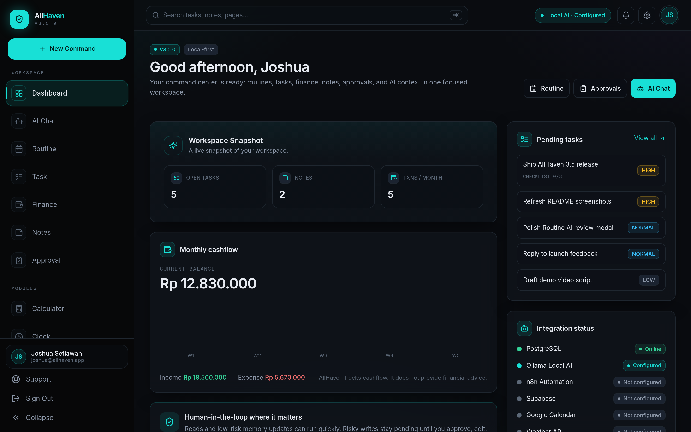
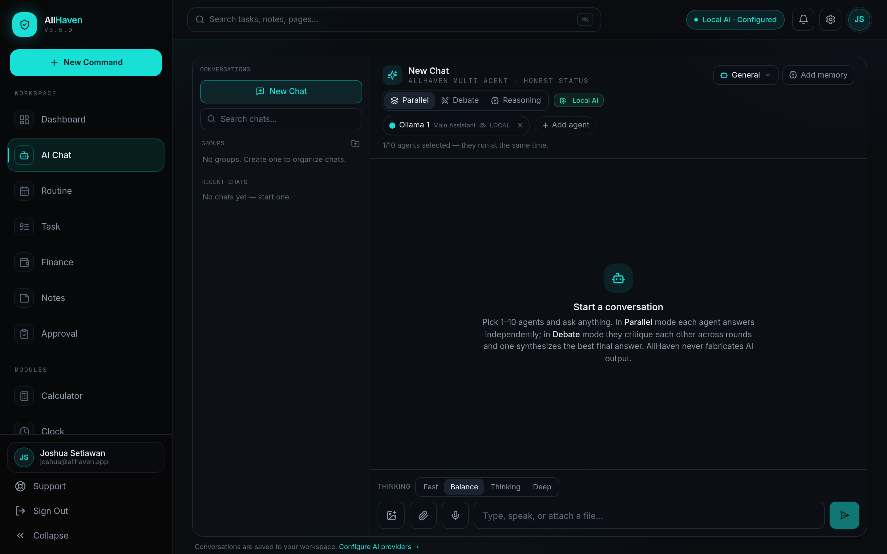

<div align="center">


# AllHaven Command Center

**A local-first AI command center for personal productivity, workspace memory, finance tracking, routines, notes, and human-approved AI actions.**

The desktop app owns the private backend. The Android APK is the mobile companion: it can run core workspace features through Supabase, and only uses the desktop bridge for local services such as Ollama and n8n.

[](CHANGELOG.md)


[Quick Start](#quick-start) | [Mobile APK](#mobile-apk) | [Features](#features) | [Docs](#documentation) | [Changelog](CHANGELOG.md)

</div>

---

## Status

**Current release:** `v4.2.0`

AllHaven is not an operating system. It is a complete web application with:

- a **FastAPI** backend;
- a **Next.js** frontend;
- a **PostgreSQL** local database;
- an optional **Supabase** cloud data layer for mobile;
- a **Capacitor Android APK** build;
- local/remote AI provider integrations with honest status checks.

### What changed in 4.2

- The whole UI moved to the **Aurora Glass** design system — every page and component restyled, behavior unchanged.
- AI chat answers greetings instantly and passes every reply through a quality gate before it reaches you.
- Routines are a first-class AI intent, and Indonesian "dapat …" phrases now register as income.
- Approvals show a typed, human-readable preview for schedules, routines, notes, and tasks — no more raw JSON.
- Desktop voice input is restored; AI memory recall/editing and the knowledge upload flow are stabilized.
- Security hardening: private-integration SSRF blocked, API docs hidden outside local mode, Drive config endpoint protected.

Read more: [release notes](docs/v4/RELEASE_NOTES_v4.2.0.md).

---

## Product Model

| Surface | Purpose | Data path |
| --- | --- | --- |
| **Desktop web app** | Full command center, local backend, local PostgreSQL, provider settings, system controls. | Browser -> FastAPI -> PostgreSQL/local services |
| **Android APK** | Mobile workspace for tasks, notes, finance, routines, approvals, memory, and AI chat UI. | APK -> Supabase for core data; optional bridge to desktop backend |
| **Backend Bridge** | Lets mobile reach desktop-only/local resources. | APK -> LAN/Tailscale/Serve URL -> FastAPI |
| **Ollama / n8n** | Remain desktop/local services by design. | Requires LAN or Tailscale bridge from mobile |

The mobile target is intentionally different from desktop: core workspace data should work without Tailscale, while local-only services use the bridge only when needed.

---

## Preview

<div align="center">



<sub>Dashboard: workspace status, finance, tasks, notes, approvals, and integration health.</sub>



<sub>AI Chat: multi-agent runs, memory context, human approvals, and honest provider status.</sub>

</div>

---

## Features

### Workspace

- Dashboard overview with monthly cashflow, pending work, and integration status.
- Tasks with checklist support, completion/reopen flow, and AI-generated drafts.
- Notes and knowledge entries with edit/save support.
- Routine planner for daily schedules and recurring plans.
- Finance tracking for categories, transactions, summaries, and reports.
- Approval center for AI-proposed write actions.

### AI

- Multi-agent chat with up to **10 agents**.
- Modes: single, parallel, debate, and reasoning.
- Providers: Ollama, OpenAI/GPT, Claude, Gemini, Grok, Blackbox, Cursor-compatible gateways, DeepSeek, Qwen, and six OpenRouter agents.
- AI Memory with controlled current facts and memory suggestions.
- AI Knowledge document upload/search for local context.
- Tool registry with human approval for risky writes.

### Mobile

- Android APK built from the same AllHaven UI through Capacitor.
- Supabase Auth/data mode for core mobile workflows.
- Backend Bridge URL can be changed inside the app; no rebuild required.
- Supports LAN, Tailscale private IP, MagicDNS, or Tailscale Serve.
- Ollama and n8n are optional bridge features, not requirements for login/core data.

### Safety

- No fake online states: integrations are online only after real test calls.
- Risky AI writes require human approval.
- API keys stay server-side and are shown masked.
- User content uses workspace scoping and soft-delete patterns.
- Local `.env` mirroring is allowlisted and writes atomically with backups.

---

## Architecture

```text
AllHaven-Application/
|-- backend/                  FastAPI, SQLAlchemy, Alembic, services, tests
|-- frontend/                 Next.js app, Capacitor Android project
|-- docs/                     setup, mobile, deployment, security, release notes
|-- installer/                install/start helpers
|-- scripts/                  doctor, healthcheck, utility scripts
|-- docker-compose.yml        local PostgreSQL
|-- allhaven.sh               start/stop/restart/status launcher
`-- README.md
```

Runtime overview:

```text
Desktop browser -> Next.js dev/server -> FastAPI -> PostgreSQL
Android APK     -> static Next.js bundle -> Supabase
Android bridge  -> LAN/Tailscale/Serve URL -> FastAPI -> Ollama/n8n/local tools
```

---

## Quick Start

### Requirements

- Python `3.11+`
- Node.js `18+` for desktop; Node `22+` recommended for Capacitor 8 APK builds
- PostgreSQL `14+` or Docker
- Optional: Ollama, n8n, Supabase project, Android SDK/JDK 21 for APK builds

### One-command local install

```bash
git clone https://github.com/joshuasetiawann/AllHaven-Application.git
cd AllHaven-Application
./install.sh
```

Then open:

```text
http://localhost:3000
```

### Daily commands

| Task | Command |
| --- | --- |
| Start everything in background | `./allhaven.sh start` |
| Run in foreground | `./allhaven.sh run` |
| Restart everything | `./allhaven.sh restart` |
| Restart one service | `./allhaven.sh restart backend` or `./allhaven.sh restart frontend` |
| Stop app services | `./allhaven.sh stop` |
| Check status | `./allhaven.sh status` |
| Diagnose setup | `./scripts/doctor.sh` |

Full guide: [Desktop setup](docs/DESKTOP_SETUP.md) and [Local setup](docs/LOCAL_SETUP.md).

---

## Manual Setup

Use this only when you do not want the installer.

```bash
cp .env.example .env
docker compose up -d postgres
```

Backend:

```bash
cd backend
python -m venv .venv
source .venv/bin/activate
pip install -r requirements.txt
alembic upgrade head
uvicorn app.main:app --host 0.0.0.0 --port 8000
```

Frontend:

```bash
cd frontend
cp .env.local.example .env.local
npm install
npm run dev
```

Health check:

```bash
curl http://localhost:8000/api/v1/health
```

---

## Mobile APK

The APK is the existing AllHaven UI packaged with Capacitor. It is not a separate redesign.

### Build debug APK

```bash
cd frontend
NEXT_PUBLIC_API_BASE_URL=http://<desktop-ip>:8000/api/v1 \
NEXT_PUBLIC_SUPABASE_URL=https://<project-ref>.supabase.co \
NEXT_PUBLIC_SUPABASE_ANON_KEY=<anon-key> \
npm run build:mobile

npx cap sync android
cd android
./gradlew assembleDebug
```

Output:

```text
frontend/android/app/build/outputs/apk/debug/app-debug.apk
```

### Mobile connection rules

- Login/core data use Supabase in the mobile build.
- If the bridge is unreachable, tasks/notes/finance/routines that are Supabase-backed should still work.
- Ollama and n8n require the desktop bridge.
- If `http://100.x.y.z:8000/api/v1/health` fails in Chrome on the phone, the APK cannot reach that backend either.
- Prefer Tailscale Serve (`https://name.tailnet.ts.net`) when raw `100.x` IP access is blocked.

Full guide: [Mobile APK guide](docs/MOBILE.md) and [Tailscale setup](docs/v4/TAILSCALE_SETUP.md).

---

## Configuration

Most local settings live in `.env`.

Important keys:

| Key | Purpose |
| --- | --- |
| `APP_ENV=local` | Enables local/private development behavior. |
| `DATABASE_URL` | PostgreSQL connection string. |
| `SECRET_KEY` | Backend auth signing secret. |
| `SUPABASE_URL` | Supabase project URL. |
| `SUPABASE_ANON_KEY` | Public anon key for Supabase clients. |
| `SUPABASE_SERVICE_ROLE_KEY` | Server-only Supabase admin/sync key. Never expose in frontend. |
| `SUPABASE_JWT_SECRET` | Lets desktop backend verify Supabase bearer tokens. |
| `OLLAMA_BASE_URL` | Local/Tailscale Ollama endpoint. |
| `N8N_BASE_URL` | Local/Tailscale n8n endpoint. |

See [.env.example](.env.example) for the full template.

---

## AI Providers

AllHaven supports:

| Provider | Notes |
| --- | --- |
| Ollama | Local/private models on your machine. |
| OpenAI / GPT | Cloud models through OpenAI-compatible APIs. |
| Claude | Anthropic models. |
| Gemini | Google models. |
| Grok | xAI models. |
| Blackbox | Coding-focused provider. |
| Cursor-compatible | OpenAI-compatible gateway slot. |
| DeepSeek | Chat/coding/reasoning models. |
| Qwen | Alibaba DashScope/OpenAI-compatible models. |
| OpenRouter 1-6 | Six independent agents with separate keys/models. |

Provider status is honest:

- `configured` means credentials/settings are saved.
- `online` means Test Connection actually succeeded.
- invalid keys stay offline.
- Ollama is online only when `/api/tags` responds.

---

## API Overview

All API routes use the `/api/v1` prefix.

| Area | Examples |
| --- | --- |
| Health | `GET /health` |
| Auth | `POST /auth/register`, `POST /auth/login`, `GET /auth/me` |
| Tasks | `GET/POST /tasks`, `PATCH/DELETE /tasks/{id}` |
| Notes | `GET/POST /notes`, `PATCH/DELETE /notes/{id}` |
| Finance | categories, transactions, summaries, reports |
| Routine | `GET/POST /routines/events`, `PUT/DELETE /routines/events/{id}` |
| AI Chat | sessions, messages, multi-agent runs |
| AI Memory | memories, settings, suggestions |
| AI Knowledge | documents, indexing, search |
| Settings | integrations, AI providers, bridge/system controls |
| Drive | file metadata, upload, download, delete |
| Automations | local draft workflows and n8n bridge status |

Interactive API docs are enabled only in local mode.

---

## Testing

Backend:

```bash
cd backend
source .venv/bin/activate
pytest
```

Frontend:

```bash
cd frontend
npm run build
```

Mobile export:

```bash
cd frontend
npm run build:mobile
```

Security and setup checks:

```bash
./scripts/doctor.sh
./scripts/healthcheck.sh
```

---

## Troubleshooting

### Mobile login says "Something went wrong"

Rebuild the APK with:

- `NEXT_PUBLIC_SUPABASE_URL`
- `NEXT_PUBLIC_SUPABASE_ANON_KEY`
- `NEXT_PUBLIC_DATA_MODE=supabase` (already set by `npm run build:mobile`)

Then uninstall the old APK or clear app data before installing the new build.

### Phone cannot open backend URL

If Chrome on the phone cannot open:

```text
http://<desktop-ip>:8000/api/v1/health
```

the APK cannot open it either. Check:

- backend is running with `--host 0.0.0.0`;
- phone and desktop are on the same Wi-Fi or same tailnet;
- firewall allows port `8000`;
- Tailscale is connected on both devices;
- the selected URL includes `/api/v1` or lets AllHaven append it.

### Port 5432 is already in use

AllHaven can reuse a native/local PostgreSQL. To run its container on another host port:

```bash
POSTGRES_HOST_PORT=5433 docker compose up -d postgres
```

Then update `.env` accordingly.

### Broken Python venv

```bash
cd backend
mv .venv ".venv.broken.$(date +%s)"
python3 -m venv .venv
.venv/bin/python -m pip install --upgrade pip
.venv/bin/python -m pip install -r requirements.txt
.venv/bin/alembic upgrade head
```

---

## Documentation

| Document | Purpose |
| --- | --- |
| [Desktop setup](docs/DESKTOP_SETUP.md) | Beginner install and launcher guide. |
| [Mobile guide](docs/MOBILE.md) | APK build, Backend Bridge, and Android notes. |
| [Tailscale setup](docs/v4/TAILSCALE_SETUP.md) | Private bridge setup for phone to desktop. |
| [Deployment](docs/DEPLOYMENT.md) | Production hosting notes. |
| [Architecture](docs/ARCHITECTURE.md) | System architecture and module boundaries. |
| [Security model](docs/SECURITY_MODEL.md) | Auth, secrets, approvals, and trust boundaries. |
| [AI tool policy](docs/AI_TOOL_POLICY.md) | Tool registry and human approval rules. |
| [Release notes 4.2](docs/v4/RELEASE_NOTES_v4.2.0.md) | Current release details. |

---

## Branches

| Branch | Role |
| --- | --- |
| `main` | Current primary release branch. |
| `master` | Kept aligned with `main` for compatibility. |
| `mobile` | Kept aligned with `main`; useful for APK/mobile-focused workflows. |

All three release branches should point at AllHaven 4.2 content.

---

## License

Copyright (c) 2026 Joshua Setiawan. All rights reserved.

AllHaven Command Center, including its source code, design, and documentation, is the intellectual property of Joshua Setiawan. See [LICENSE](LICENSE) for terms.

<div align="center">
<sub>Built with FastAPI, Next.js, PostgreSQL, Supabase, and Capacitor.</sub>
</div>
