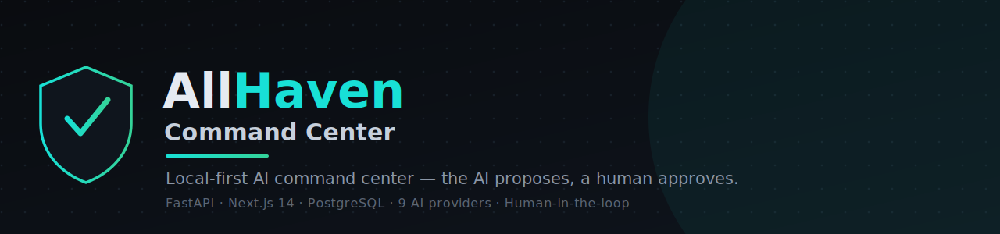

# 🛡️ AllHaven — Version Archive

**The complete release history of [AllHaven Command Center](../../tree/main).**

Every version is frozen in its own self-contained `AllHaven X.Y` folder — a full,
runnable snapshot. The latest version also lives on the [`main`](../../tree/main) branch.

&nbsp;
&nbsp;

---

## 📦 About this branch

- **`master`** (this branch) — the **full archive**: every release in its own
  `AllHaven X.Y` folder, a complete snapshot you can open and run on its own.
- **[`main`](../../tree/main)** — only the **latest** version, flat at the repo root,
  ready to run or deploy.

> **Numbering** runs `0.1 → 0.9`, `1.0 → 1.9`, then `2.0` onward, so the folders sort and
> read naturally. **Era** marks the early **CoreOS** prototype vs. the **AllHaven** product
> (rebranded at 1.4). **Semantic** is the internal `vX.Y.Z` used from the rebrand onward.

## 🗓️ Release history

| Version | Released | Era | Semantic | What this update introduced |
|:--|:--|:--|:--|:--|
| **AllHaven 0.1** | 2026-06-08 | CoreOS | — | Initial base — FastAPI + PostgreSQL backend, Next.js + TS + Tailwind frontend, auth, and the first modules (Tasks, Notes, Finance). |
| **AllHaven 0.2** | 2026-06-08 | CoreOS | — | UI layer — app layout (PageHeader, nav) and a reusable UI kit (Avatar, BarChart, IconButton, Select, Tabs, Toggle) + user preferences. |
| **AllHaven 0.3** | 2026-06-08 | CoreOS | — | AI provider system — provider router, provider registry, encrypted secrets, integration config service + schemas (migration `0002`). |
| **AllHaven 0.4** | 2026-06-08 | CoreOS | — | New module pages (Drive, Calendar, Weather, Automations) + task checklists (migration `0003`) + the Blackbox provider. |
| **AllHaven 0.5** | 2026-06-08 | CoreOS | — | Google OAuth foundation (router + service + card) and Ollama provider tests. |
| **AllHaven 0.6** | 2026-06-08 | CoreOS | — | Per-workspace **AI policy** — allow/deny external AI providers. |
| **AllHaven 0.7** | 2026-06-08 | CoreOS | — | Command palette (⌘K) for fast navigation/search. |
| **AllHaven 0.8** | 2026-06-08 | CoreOS | — | One-command setup/run helper script. |
| **AllHaven 0.9** | 2026-06-08 | CoreOS | — | Stability fixes and refinements (no new surface). |
| **AllHaven 1.0** | 2026-06-09 | CoreOS | — | **Multi-agent chat + module backends** — concurrent agents and Drive/Calendar/Weather/Automations APIs (migration `0004`). |
| **AllHaven 1.1** | 2026-06-09 | CoreOS | — | Session memory / project documentation. |
| **AllHaven 1.2** | 2026-06-09 | CoreOS | — | **Production deployment** — Dockerfiles, prod compose with Caddy HTTPS, deploy guide. |
| **AllHaven 1.3** | 2026-06-09 | CoreOS | — | Cross-OS run scripts + local-setup and release docs. |
| **AllHaven 1.4** | 2026-06-09 | **AllHaven** | `v0.3.0` | Rebrand to AllHaven + responsive UI, **multi-agent Debate** mode, and the **Reasoning Quality Layer** (Analyst → Critic → Synthesizer with grounded, verified reasoning). |
| **AllHaven 1.5** | 2026-06-09 | **AllHaven** | `v0.4.0` | **Image input (vision)** — attach images and have agents respond to them — plus **Markdown-rendered chat output**. |
| **AllHaven 1.6** | 2026-06-09 | **AllHaven** | `v0.5.0` | **Calculator** & **Clock** modules, **Thinking Mode** (Fast/Balance/Thinking/Deep), chat modes simplified to Parallel/Debate/Reasoning, and **vision routing** (images go only to vision-capable models). |
| **AllHaven 1.7** | 2026-06-10 | **AllHaven** | `v0.5.1` | Honest **"this model can't read images — pick a vision model"** status when a vision provider gets an image but the chosen model is text-only. |
| **AllHaven 1.8** | 2026-06-10 | **AllHaven** | `v0.6.0` | **Launch hardening** — HTTP security headers (backend + frontend CSP), safe Drive downloads, and dependency patches. Full audit in `LAUNCH_SECURITY_REPORT.md`. |
| **AllHaven 1.9** | 2026-06-10 | **AllHaven** | `v0.7.0` | **Public-launch auth** — HttpOnly **cookie sessions** (server-side, rotation + revocation), **CSRF** double-submit, `/auth/*` **rate limiting**, and a production **SECRET_KEY guard**. |
| **AllHaven 2.0** | 2026-06-10 | **AllHaven** | `v0.8.0` | **Live n8n workflows** in Automations — list real workflows from the connected n8n, **activate/deactivate**, and **open in n8n** (API key stays server-side). |
| **AllHaven 2.1** | 2026-06-10 | **AllHaven** | `v0.9.0` | **One-click desktop installer** — OS launchers + a browser **setup wizard** (Docker / ports / `.env` checks), a localhost-only **token-gated control agent**, and in-app **Settings → System Control**. |
| **AllHaven 2.2** | 2026-06-10 | **AllHaven** | `v0.10.0` | **Reliable one-click startup + responsive menu** — launch faithful to `allhaven.sh` (bind `0.0.0.0`, wait for PostgreSQL, run migrations, health-gate, install deps, surface logs), fixing *"works manually but not from the app"*. Plus a collapsible, responsive nav menu. |
| **AllHaven 2.3** | 2026-06-10 | **AllHaven** | `v0.11.0` | **Terminal installer + config sync** — install & start from the **terminal by default** with live progress (Docker pull, `pip`, `npm`); `backend/.env` mirrors the root `.env`; faster Docker check. Browser wizard via `HAVEN_SETUP_WEB=1`. |
| **AllHaven 2.4** | 2026-06-11 | **AllHaven** | `v0.12.0` | **App-wide AI tools with human approval** — a safe, allowlisted **Tool Registry** (35 tools) connects AI Chat to every module: reads execute, **writes await your Approve/Edit/Reject** (HIGH-risk always). Plus **6 OpenRouter agents**, **2 model slots per provider**, **up to 7 agents** with distinct roles, a **debate-flow visibility toggle**, output-quality polish, and Settings → AI Tools / AI Chat. |
| **AllHaven 2.5** | 2026-06-11 | **AllHaven** | `v0.13.0` | **GUI-first install** (superseded by 2.6) — the terminal bootstrapped a **browser Setup Wizard** for OS/Docker checks, ports, `.env`, live progress, health, shortcut, open app. New entry points `./install.sh` and `npm run setup`. |
| **AllHaven 2.6** | 2026-06-11 | **AllHaven** | `v0.14.0` | **Terminal-only install** — install & start run **entirely in the terminal** again (live Docker/`pip`/`npm` progress); the browser wizard is now **opt-in** (`HAVEN_SETUP_WEB=1`), and the Docker check is faster (4s). The desktop shortcut starts services & opens Haven with no terminal. |
| **AllHaven 2.7** | 2026-06-12 | **AllHaven** | `v0.15.0` | **Premium UI polish + persistent model selection + per-section chat memory** — AI Chat now remembers your **model/agents, mode & thinking** across navigation/refresh (with availability fallback + clear warnings); each module **and each chat project/group** keeps its own **local, secret-redacted memory** the AI uses for relevance; **smooth micro-animations** that honor `prefers-reduced-motion`; polished Finance/Settings; and a fix for the session-check flash on every navigation. A frontend/UX release. |
| **AllHaven 2.8** | 2026-06-12 | **AllHaven** | `v0.16.0` | **Persistent AI memory** — auto-learns user context from chat (secret-safe, approval flow), injects it into all four chat modes, adds memory tools with human approval, a memory management page, and optional Supabase sync (migration `0007`). |
| **⭐ AllHaven 2.9** | 2026-06-13 | **AllHaven** | `v0.17.0` | **Current.** **AI Workspace + Knowledge + finance reports + launch polish** — section-aware context packets, AI Knowledge document ingestion/search/retrieval with metadata-only storage for unsupported files, dedicated tool-call logging, 72 allowlisted tools, configurable Drive upload limits, monthly/weekly finance reports with archived/out-of-period records, local date/time answers, direct low-risk memory saves, a dedicated Approvals page, app-wide toast notifications, responsive UI across desktop/tablet/mobile, cleaner approval notifications, fresh-clone install guardrails, and a more direct conversational AI for coding and schedule management (migration `0008`). |

⭐ = current release. Dates reflect each version's build/release during the project's initial development sprint.

## 🌱 How the two branches relate

Each `AllHaven X.Y` folder is a complete, standalone snapshot you can open and run on
its own; the latest (`AllHaven 2.9`) keeps its own `CHANGELOG.md`, `VERSION`, and
`docs/releases/` inside it. New releases add the next folder here, while
[`main`](../../tree/main) is fast-forwarded to the same version.

---

**© 2026 Joshua Setiawan.** All rights reserved.

AllHaven Command Center — crafted by <b>Joshua Setiawan</b>

